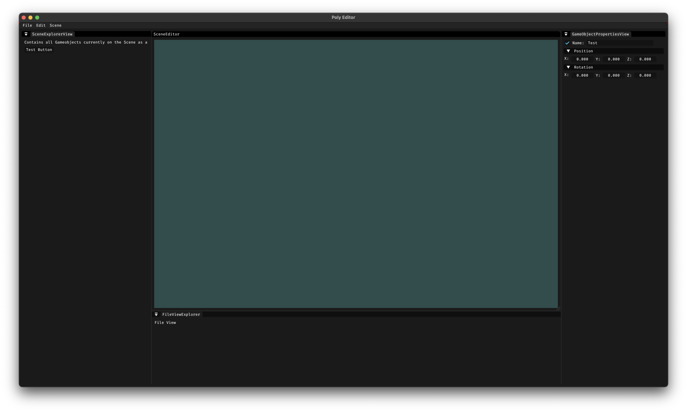

## About

**PolyEngine** is a engine designed specifically for low poly games.

## Engine Features

## in development:

| Feature                           | Status |
|-----------------------------------|--------|
| **Basic GL 3D Rendering**         | 🚧 WIP |
| **Level / Scene**                 | 🚧 WIP |
| **Basic Entity component system** | 🚧 WIP |
| **Mesh Component**                | 🚧 WIP |
| **Mesh Rendering component**      | 🚧 WIP |

### planned:

| Feature                  |
|--------------------------|
| **Basic Physics system** |
| **Physics component**    |